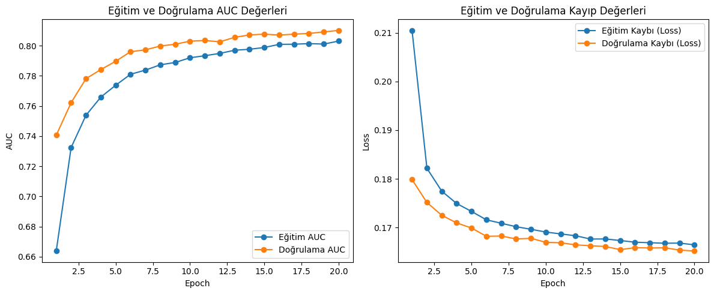

#  Akciğer Hastalıkları Teşhis Sistemi (Chest X-Ray Pathology Detection)

Bu proje, göğüs röntgeni (X-ray) görüntülerini analiz ederek **14 farklı akciğer patolojisini** aynı anda tespit edebilen derin öğrenme tabanlı bir teşhis sistemidir. Model, tıp uzmanlarına ve klinik süreçlere destek olmak amacıyla geliştirilmiş olup, sonuçları kullanıcı dostu bir web arayüzü üzerinden sunmaktadır.

##  Proje Özellikleri

* **Çoklu Etiketli Sınıflandırma (Multi-label Classification):** Bir röntgen görüntüsünde birden fazla hastalığın aynı anda bulunabilme ihtimali göz önüne alınarak geliştirilmiştir.
* **14 Farklı Patoloji Tespiti:** Atelektazi, Kardiyomegali, Efizyon, İnfiltrasyon, Kitle, Nodül, Pnömoni, Pnömotoraks, Konsolidasyon, Ödem, Amfizem, Fibrozis, Plevral Kalınlaşma ve Fıtık tespiti.
* **Hızlı ve Pratik Arayüz:** Kullanıcıların kolayca röntgen yükleyip analiz sonuçlarını anında görebileceği web tabanlı sistem (`app.py`).
* **Kapsamlı Eğitim Süreci:** Derin öğrenme modelinin veri ön işleme, eğitim ve doğrulama adımlarının tüm detayları interaktif olarak dökümante edilmiştir (`teshis.ipynb`).

---

##  Kullanılan Teknolojiler

* **Geliştirme Dili:** Python
* **Derin Öğrenme / Makine Öğrenmesi:** TensorFlow, Keras
* **Görüntü İşleme:** OpenCV, NumPy, Pillow
* **Web Çerçevesi:** Flask / Streamlit (app.py altyapısı)
* **Veri Analizi:** Pandas, Matplotlib

---

##  Model Performansı ve Eğitim Süreci

Modelin eğitim sürecindeki başarısı (Accuracy) ve kayıp (Loss) değerleri `training_plot.png` üzerinde görselleştirilmiştir. Aşırı öğrenmeyi (overfitting) engellemek için veri artırma (data augmentation) ve erken durdurma (early stopping) gibi teknikler kullanılmıştır.

> **Not:** Modelin eğitimi için kullanılan NIH Chest X-ray 14 veri seti boyutu nedeniyle bu repoda bulunmamaktadır. Veri setine [Kaggle - NIH Chest X-rays](https://www.kaggle.com/datasets/nih-chest-xrays/data) üzerinden ulaşabilirsiniz.



---

##  Kurulum ve Çalıştırma

Projeyi kendi bilgisayarında çalıştırmak için aşağıdaki adımları sırasıyla izleyebilirsin.

**1. Repoyu Klonlayın**
```bash
git clone [https://github.com/KULLANICI_ADIN/Akciger_Teshis_Projesi.git](https://github.com/ozdizlekli/Akciger_Teshis_Projesi.git)
cd Akciger_Teshis_Projesi
